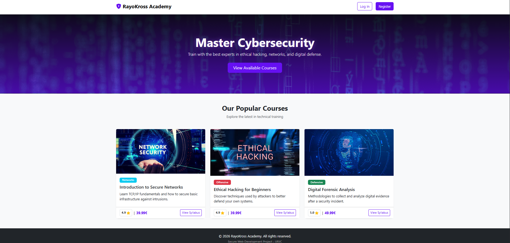
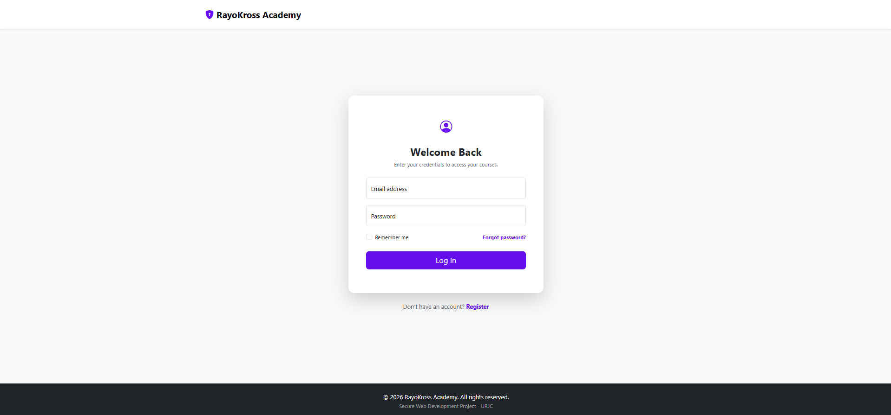
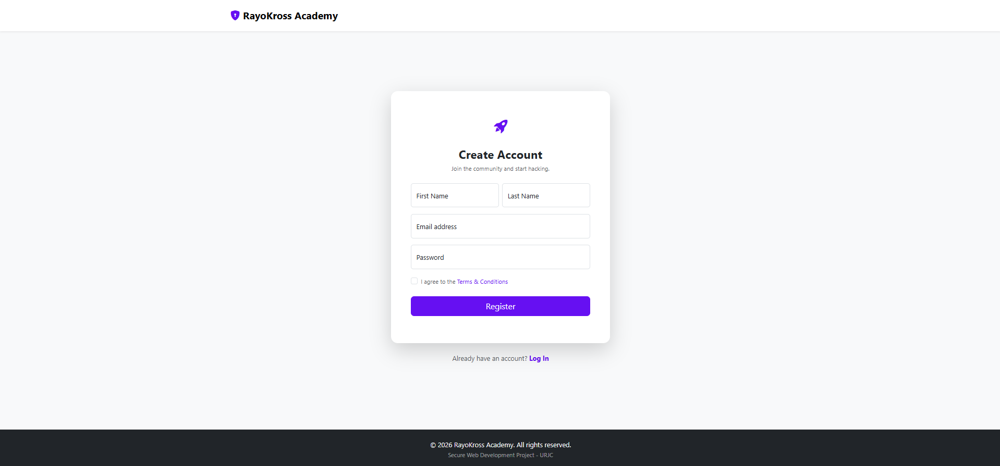
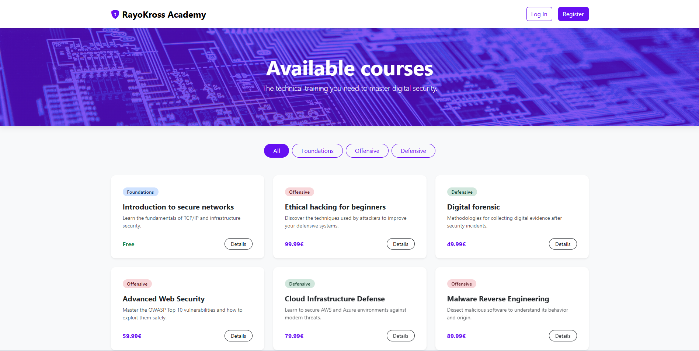
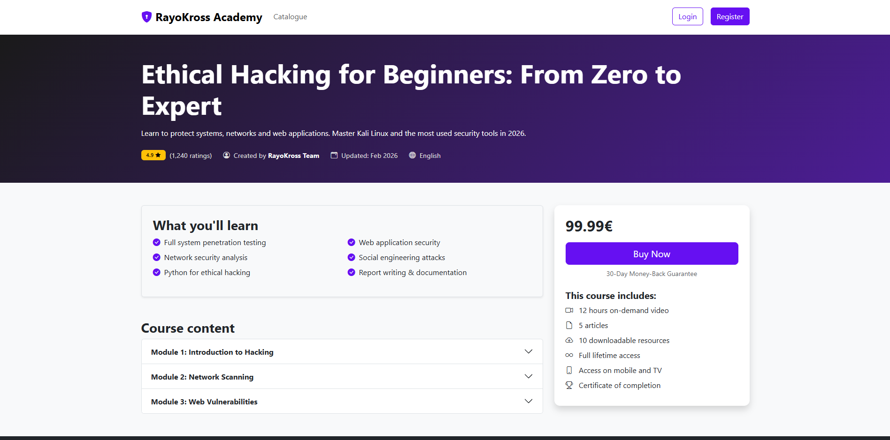
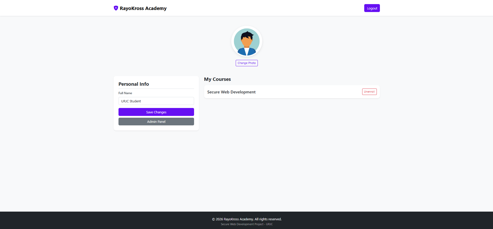
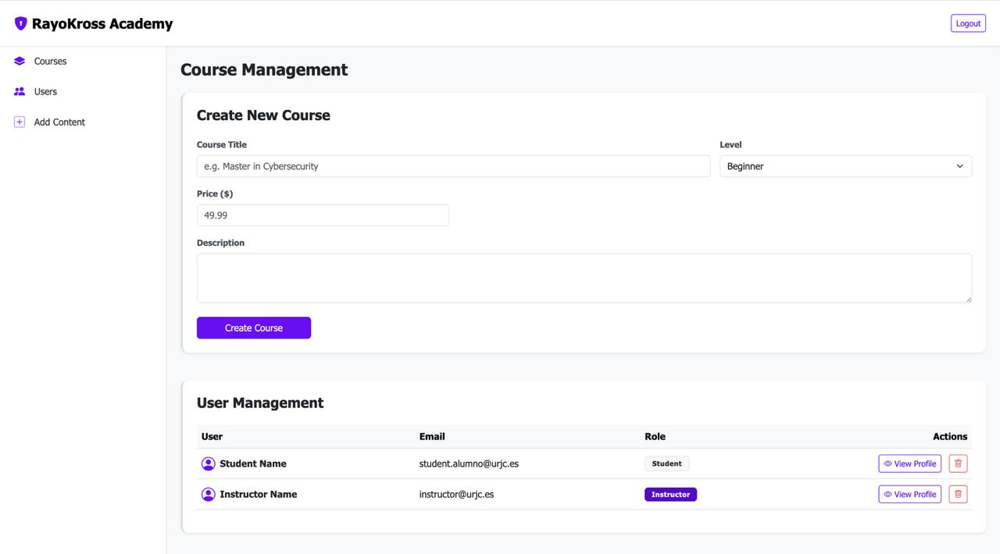

# RayoKross Academy

## 👥 Miembros del Equipo
| Nombre y Apellidos | Correo URJC | Usuario GitHub |
|:--- |:--- |:--- |
| Omar Ba Diallo | oa.ba.2024@alumnos.urjc.es | MalcomJrr |
| Daniel Fernández Tomé | d.fernandezt.2024@alumnos.urjc.es | danicroko |
| Ángel Menéndez Leyenda | a.menendez.2024@alumnos.urjc.es | angelmnndez |
| Gonzalo Roig López | g.roig.2024@alumnos.urjc.es | groig-0 |

---

## 🎭 **Preparación: Definición del Proyecto**

### **Descripción del Tema**
Esta aplicación web consiste en una plataforma de formación online orientada al ámbito de la ciberseguridad diseñada para gestionar cursos académicos. El sistema permite a los profesores publicar contenido educativo y a los alumnos matricularse para acceder a dicho material. A su vez, permite al usuario acceder a recursos educativos (como imágenes y vídeos de apoyo) y el progreso del alumno.

### **Entidades**
Indicar las entidades principales que gestionará la aplicación y las relaciones entre ellas:

1. Usuario: Representa a las personas que interactúan con la web (Alumnos y Profesores/Administradores).
2. Curso: Representa el curso que se imparte (ej: "Curso de redes").
3. Recuros académicos: Unidad de contenido dentro de un curso (ej: "Tema 1: Variables"). Aquí es donde se alojarán los materiales.
4. Matrícula: Representa la inscripción de un alumno en un curso específico.

**Relaciones entre entidades:**
- Usuario - Matrícula: Un usuario (alumno) puede tener múltiples matrículas (1:N).
- Curso - Matrícula: Un curso puede tener múltiples matrículas asociadas a distintos alumnos (1:N).
- Curso - Lección: Un curso se compone de múltiples lecciones, pero una lección pertenece a un único curso (1:N).
- Usuario - Curso: Un usuario (profesor) puede crear/ser dueño de múltiples cursos (1:N).

### **Permisos de los Usuarios**
La aplicación distingue tres roles con permisos diferenciados sobre los datos:

* **Usuario Anónimo**: 
  - Permisos: Visualización del catálogo público de cursos, búsqueda de cursos por nombre o categoría, acceso a la página de login y registro.
  - No es dueño de ninguna entidad

* **Usuario Registrado**: 
  - Permisos: Todo lo del anónimo más: capacidad para matricularse en cursos, acceso al contenido detallado (lecciones) solo de los cursos donde esté matriculado, edición de su propio perfil.
  - Es dueño de: Su Perfil de Usuario (puede editar sus datos y foto) y sus Matrículas (puede cancelar su propia matrícula).

* **Administrador**: 
  - Permisos: Gestión completa de la plataforma. Puede crear nuevos cursos, añadir lecciones a los cursos, eliminar usuarios y visualizar todas las matrículas.
  - Es dueño de: Todos los Cursos y Lecciones creados en la plataforma.

### **Imágenes**
Se cumple el requisito de subida de imágenes en las siguientes entidades:

- Usuario: Cada usuario podrá subir una imagen de avatar o perfil.
- Curso: Cada curso tendrá una imagen de portada representativa que se mostrará en el catálogo.

---

## 🛠 **Práctica 1: Maquetación de páginas con HTML y CSS**

### **Vídeo de Demostración**
📹 **[Enlace al vídeo en YouTube](https://youtu.be/eTdlfR7YGfs)**
> Vídeo mostrando las principales funcionalidades de la aplicación web.

### **Diagrama de Navegación**
Diagrama que muestra cómo se navega entre las diferentes páginas de la aplicación:


> Flujo de Navegación

Acceso Público: El usuario llega a la Home, explora el Catálogo o consulta el Detalle de los 3 cursos destacados.

Autenticación: Mediante Login/Registro, el sistema identifica al usuario.

Zona Privada: El flujo redirige al Perfil (gestión del alumno), desde donde se accede al Aula para ver lecciones.

Gestión (Admin): Desde el perfil, los usuarios autorizados saltan al Dashboard de Admin para gestionar cursos y usuarios.

Esquema: Home → Login → Perfil → Admin.

### **Capturas de Pantalla y Descripción de Páginas**

#### **1. Página Principal / Home**


> Página de inicio que muestra los productos destacados. Incluye barra de navegación y acceso a registro/login para usuarios no autenticados.

#### **2. Página Login / Iniciar sesión**


> Página de inicio de sesión que permite a usuarios previamente registrados autenticarse.

#### **3. Página Register / Registrarse**


> Página de registro que permite a nuevos usuarios crearse un usuario.

#### **4. Página Cursos / Catálogo**


> Página que muestra todos los cursos disponibles para cursar.

#### **5. Página Detalle curso**


> Página que muestra las características del curso como duración, contenido. Además de la opción para poder comprar el curso.

#### **6. Página Profile / Perfil**


> Página que muestra el perfil de un usuario autenticado que permite ver los datos, los cursos en los que está matriculado pudiendo desmatricularse, cambiar la foto de perfil, acceder al panel de administración (en caso de ser Administrador) y cerrar sesión

#### **7. Página Admin / Administrador**


> Página única para administradores que permite la creación de nuevos cursos y administrarlos.

### **Participación de Miembros en la Práctica 1**

#### **Alumno 1 - Omar Ba Diallo**

Realización y diseño de la página principal, la página de registro y la página de inicio de sesión

| Nº    | Commits      | Files      |
|:------------: |:------------:| :------------:|
|1| [Creación de la página principal, login y registro](https://github.com/DWS-2026/dws-2026-project-base/commit/41b1ca27f74afa8e673aa28f5e37fcc67480eed5)  | [Archivo1](index.html)   |
|2| [Actualización para la navegación de los botones](URL_commit_2)  | [Archivo2](URL_archivo_2)   |
|3| [Página de register creada](URL_commit_3)  | [Archivo3](URL_archivo_3)   |
|4| [Descripción commit 4](URL_commit_4)  | [Archivo4](#)   |
|5| [Descripción commit 5](URL_commit_5)  | [Archivo5](URL_archivo_5)   |

---

#### **Alumno 2 - Daniel Fernández Tomé**

Creación de la página de descripción de los cursos y diseño de la barra de navegación de la web

| Nº    | Commits      | Files      |
|:------------: |:------------:| :------------:|
|1| ([Descripcion del curso creada](https://github.com/DWS-2026/dws-2026-project-base/commit/93db7dcec9628f109bb27726831706979c3db893)) | [courseDescription.html]   |
|2| [Descripción commit 2](URL_commit_2)  | [Archivo2](URL_archivo_2)   |
|3| [Descripción commit 3](URL_commit_3)  | [Archivo3](URL_archivo_3)   |
|4| [Descripción commit 4](URL_commit_4)  | [Archivo4](URL_archivo_4)   |
|5| [Descripción commit 5](URL_commit_5)  | [Archivo5](URL_archivo_5)   |

---

#### **Alumno 3 - Ángel Menéndez Leyenda**

Maquetación de Perfil, Admin y estilos CSS

| Nº    | Commits      | Files      |
|:------------: |:------------:| :------------:|
|1| ([Perfil y Panel admin](https://github.com/DWS-2026/dws-2026-project-base/commit/563fabc9533ad550eed6473b74855a34ed29a1b0))  | [admin_dashboard.html][css/styles.css][perfil.html]|
|2| [Ampliacion del panel de admin con una lista para visualizar alumnos y adminsitradores]([URL_commit_2](https://github.com/DWS-2026/dws-2026-project-base/commit/d6c6bbe206def450a190debfbb7c2d0cfc022403))  | [admin_dashboard.html]   |
|3| [Descripción commit 3](URL_commit_3)  | [Archivo3](URL_archivo_3)   |
|4| [Descripción commit 4](URL_commit_4)  | [Archivo4](URL_archivo_4)   |
|5| [Descripción commit 5](URL_commit_5)  | [Archivo5](URL_archivo_5)   |

---

#### **Alumno 4 - Gonzalo Roig López**

Creación y diseño de la página que contiene todos los cursos disponibles

| Nº    | Commits      | Files      |
|:------------: |:------------:| :------------:|
|1| [Catálogo de cursos creado](https://github.com/DWS-2026/dws-2026-project-base/commit/00dc2b86925732d96ea741494bc25bb1e774efe8))  | [courses.html] [css/styles.css])   |
|2| [Descripción commit 2](URL_commit_2)  | [Archivo2](URL_archivo_2)   |
|3| [Descripción commit 3](URL_commit_3)  | [Archivo3](URL_archivo_3)   |
|4| [Descripción commit 4](URL_commit_4)  | [Archivo4](URL_archivo_4)   |
|5| [Descripción commit 5](URL_commit_5)  | [Archivo5](URL_archivo_5)   |

---

## 🛠 **Práctica 2: Web con HTML generado en servidor**

### **Vídeo de Demostración**
📹 **[Enlace al vídeo en YouTube](https://www.youtube.com/watch?v=x91MPoITQ3I)**
> Vídeo mostrando las principales funcionalidades de la aplicación web.

### **Navegación y Capturas de Pantalla**

#### **Diagrama de Navegación**

Solo si ha cambiado.

#### **Capturas de Pantalla Actualizadas**

Solo si han cambiado.

### **Instrucciones de Ejecución**

#### **Requisitos Previos**
- **Java**: versión 21 o superior
- **Maven**: versión 3.8 o superior
- **MySQL**: versión 8.0 o superior
- **Git**: para clonar el repositorio

#### **Pasos para ejecutar la aplicación**

1. **Clonar el repositorio**
   ```bash
   git clone https://github.com/[usuario]/[nombre-repositorio].git
   cd [nombre-repositorio]
   ```

2. **AQUÍ INDICAR LO SIGUIENTES PASOS**

#### **Credenciales de prueba**
- **Usuario Admin**: usuario: `admin`, contraseña: `admin`
- **Usuario Registrado**: usuario: `user`, contraseña: `user`

### **Diagrama de Entidades de Base de Datos**

Diagrama mostrando las entidades, sus campos y relaciones:


> [Descripción opcional: Ej: "El diagrama muestra las 4 entidades principales: Usuario, Producto, Pedido y Categoría, con sus respectivos atributos y relaciones 1:N y N:M."]

### **Diagrama de Clases y Templates**

Diagrama de clases de la aplicación con diferenciación por colores o secciones:


> [Descripción opcional del diagrama y relaciones principales]

### **Participación de Miembros en la Práctica 2**

#### **Alumno 1 - [Nombre Completo]**

[Descripción de las tareas y responsabilidades principales del alumno en el proyecto]

| Nº    | Commits      | Files      |
|:------------: |:------------:| :------------:|
|1| [Descripción commit 1](URL_commit_1)  | [Archivo1](URL_archivo_1)   |
|2| [Descripción commit 2](URL_commit_2)  | [Archivo2](URL_archivo_2)   |
|3| [Descripción commit 3](URL_commit_3)  | [Archivo3](URL_archivo_3)   |
|4| [Descripción commit 4](URL_commit_4)  | [Archivo4](URL_archivo_4)   |
|5| [Descripción commit 5](URL_commit_5)  | [Archivo5](URL_archivo_5)   |

---

#### **Alumno 2 - [Daniel Fernandez Tome]**

Descripción de las tareas y responsabilidades principales del alumno en el proyecto:

Creación de controladores: UserController, CourseController, AdminUserController, AuthController, MainController.

Gestión de base de datos y modelos: Configuración de relaciones en entidades como Course.java, gestión de validaciones en User.java, y migración de la base de datos a MySQL.

Servicios: Implementación de métodos de búsqueda y borrado en UserService y formateo de fechas en Enrollment.java.

Seguridad: Creación del AuthController, gestión de contraseñas en app.properties, restricciones entre admins y users, modificación de vista del perfil de usuario desde el admin.

Gestión de inscripciones: Funcionalidades de añadir y eliminar usuarios de los cursos.

| Nº    | Commits      | Files      |
|:------------: |:------------:| :------------:|
|1| [Rating deleted](https://github.com/DWS-2026/dws-2026-project-base/commit/a60e2d8ca595241d938b560bad972fd79b7c87ce)  | [DataBaseInitializer](‎src/main/java/com/rayokross/academy/DatabaseInitializer.java‎)   |
|2| [AdminUserController added]([URL_commit_2](https://github.com/DWS-2026/dws-2026-project-base/commit/7bcc81ce54cd72dde51bea096bd5ad27413d9325))  | [AdminUserController](src/main/java/com/rayokross/academy/controllers/AdminUserController.java)   |
|3| [AuthController created]([[URL_commit_3](https://github.com/DWS-2026/dws-2026-project-base/commit/ef4db4151a7505beddc336b7bcb49046e49b4bbf)  | [AuthController](src/main/java/com/rayokross/academy/controllers/AuthController.java)   |
|4| [relations added and getters and setters modified in course.java](https://github.com/DWS-2026/dws-2026-project-base/commit/5f175d5e3a3732aba45d0931e6ffdfd71294decb)  | [Course.java](‎src/main/java/com/rayokross/academy/models/Course.java)   |
|5| [UserController created](https://github.com/DWS-2026/dws-2026-project-base/commit/5dba9c02f20c24875c71f127cc671307930fd6b4)  | [UserController](src/main/java/com/rayokross/academy/controllers/UserController.java)   |

---

#### **Alumno 3 - [Nombre Completo]**

[Descripción de las tareas y responsabilidades principales del alumno en el proyecto]

| Nº    | Commits      | Files      |
|:------------: |:------------:| :------------:|
|1| [Descripción commit 1](URL_commit_1)  | [Archivo1](URL_archivo_1)   |
|2| [Descripción commit 2](URL_commit_2)  | [Archivo2](URL_archivo_2)   |
|3| [Descripción commit 3](URL_commit_3)  | [Archivo3](URL_archivo_3)   |
|4| [Descripción commit 4](URL_commit_4)  | [Archivo4](URL_archivo_4)   |
|5| [Descripción commit 5](URL_commit_5)  | [Archivo5](URL_archivo_5)   |

---

#### **Alumno 4 - [Gonzalo Roig López]**

Descripción de las tareas y responsabilidades principales del alumno en el proyecto:

Creación de imágenes para los cursos en course_description, el index y el catálogo de cursos, además de una paginación ene el catálogo de cursos. Validación de las imágenes añadidas.

Creación del sistema del carrito creando CartController, CartService y cart.html y demás correcciones en este sistema.

Encargado de añadir y configurar Spring Security, crando SecurityConfig.java y RepositoryUserDetailsService, cifrado de contraseñas implementando BCrypt tanto en UserService como en DataBaseInitializer, prevención a ataques XSS y creación de keystore y configuración en application.properties para admitir conexiones https.

Validación de campos en login, register y en el panel de administrador.


| Nº    | Commits      | Files      |
|:------------: |:------------:| :------------:|
|1| [Add pagination in courses and add images]([URL_commit_1](https://github.com/DWS-2026/dws-2026-project-base/commit/32972f763f64af82b2daa9ac33010f4a68e2d690))  | [CourseController] (src/main/java/com/rayokross/academy/controllers/CourseController.java
|2| [fix validation and deny negative prices and files in image of course in admin dashboard]([URL_commit_2](https://github.com/DWS-2026/dws-2026-project-base/commit/79b3359e2af7dc7505131bc571f7419f6770d57d))  | [AdminCourseController]  | (src/main/java/com/rayokross/academy/controllers/AdminCourseController.java
|3| [CartController and CartService]([URL_commit_3](https://github.com/DWS-2026/dws-2026-project-base/commit/4c90b54fa73f67b8cdbedc22253bd5fe07493a02))  | [CartController, CartService]| (src/main/java/com/rayokross/academy/controllers/CartController.java
|4| [Add manual validation for registration and login error handling](https://github.com/DWS-2026/dws-2026-project-base/commit/5ac274dd7b87aa0e9ddf092d6a20e46a6bf69ad4))  | [AuthController]   | (src/main/java/com/rayokross/academy/controllers/AuthController.java)
|5| [SecurityConfig added]((https://github.com/DWS-2026/dws-2026-project-base/commit/e8fddb7824cc1b96a298234b39a6995e0987d613))  | [SecurityConfig]   |
(src/main/java/com/rayokross/academy/security/SecurityConfig.java)

---

## 🛠 **Práctica 3: Incorporación de una API REST a la aplicación web, análisis de vulnerabilidades y contramedidas**

### **Vídeo de Demostración**
📹 **[Enlace al vídeo en YouTube](https://www.youtube.com/watch?v=x91MPoITQ3I)**
> Vídeo mostrando las principales funcionalidades de la aplicación web.

### **Documentación de la API REST**

#### **Especificación OpenAPI**
📄 **[Especificación OpenAPI (YAML)](/api-docs/api-docs.yaml)**

#### **Documentación HTML**
📖 **[Documentación API REST (HTML)](https://raw.githack.com/[usuario]/[repositorio]/main/api-docs/api-docs.html)**

> La documentación de la API REST se encuentra en la carpeta `/api-docs` del repositorio. Se ha generado automáticamente con SpringDoc a partir de las anotaciones en el código Java.

### **Diagrama de Clases y Templates Actualizado**

Diagrama actualizado incluyendo los @RestController y su relación con los @Service compartidos:


#### **Credenciales de Usuarios de Ejemplo**

| Rol | Usuario | Contraseña |
|:---|:---|:---|
| Administrador | admin | admin123 |
| Usuario Registrado | user1 | user123 |
| Usuario Registrado | user2 | user123 |

### **Participación de Miembros en la Práctica 3**

#### **Alumno 1 - [Nombre Completo]**

[Descripción de las tareas y responsabilidades principales del alumno en el proyecto]

| Nº    | Commits      | Files      |
|:------------: |:------------:| :------------:|
|1| [Descripción commit 1](URL_commit_1)  | [Archivo1](URL_archivo_1)   |
|2| [Descripción commit 2](URL_commit_2)  | [Archivo2](URL_archivo_2)   |
|3| [Descripción commit 3](URL_commit_3)  | [Archivo3](URL_archivo_3)   |
|4| [Descripción commit 4](URL_commit_4)  | [Archivo4](URL_archivo_4)   |
|5| [Descripción commit 5](URL_commit_5)  | [Archivo5](URL_archivo_5)   |

---

#### **Alumno 2 - [Nombre Completo]**

[Descripción de las tareas y responsabilidades principales del alumno en el proyecto]

| Nº    | Commits      | Files      |
|:------------: |:------------:| :------------:|
|1| [Descripción commit 1](URL_commit_1)  | [Archivo1](URL_archivo_1)   |
|2| [Descripción commit 2](URL_commit_2)  | [Archivo2](URL_archivo_2)   |
|3| [Descripción commit 3](URL_commit_3)  | [Archivo3](URL_archivo_3)   |
|4| [Descripción commit 4](URL_commit_4)  | [Archivo4](URL_archivo_4)   |
|5| [Descripción commit 5](URL_commit_5)  | [Archivo5](URL_archivo_5)   |

---

#### **Alumno 3 - [Nombre Completo]**

[Descripción de las tareas y responsabilidades principales del alumno en el proyecto]

| Nº    | Commits      | Files      |
|:------------: |:------------:| :------------:|
|1| [Descripción commit 1](URL_commit_1)  | [Archivo1](URL_archivo_1)   |
|2| [Descripción commit 2](URL_commit_2)  | [Archivo2](URL_archivo_2)   |
|3| [Descripción commit 3](URL_commit_3)  | [Archivo3](URL_archivo_3)   |
|4| [Descripción commit 4](URL_commit_4)  | [Archivo4](URL_archivo_4)   |
|5| [Descripción commit 5](URL_commit_5)  | [Archivo5](URL_archivo_5)   |

---

#### **Alumno 4 - [Nombre Completo]**

[Descripción de las tareas y responsabilidades principales del alumno en el proyecto]

| Nº    | Commits      | Files      |
|:------------: |:------------:| :------------:|
|1| [Descripción commit 1](URL_commit_1)  | [Archivo1](URL_archivo_1)   |
|2| [Descripción commit 2](URL_commit_2)  | [Archivo2](URL_archivo_2)   |
|3| [Descripción commit 3](URL_commit_3)  | [Archivo3](URL_archivo_3)   |
|4| [Descripción commit 4](URL_commit_4)  | [Archivo4](URL_archivo_4)   |
|5| [Descripción commit 5](URL_commit_5)  | [Archivo5](URL_archivo_5)   |
